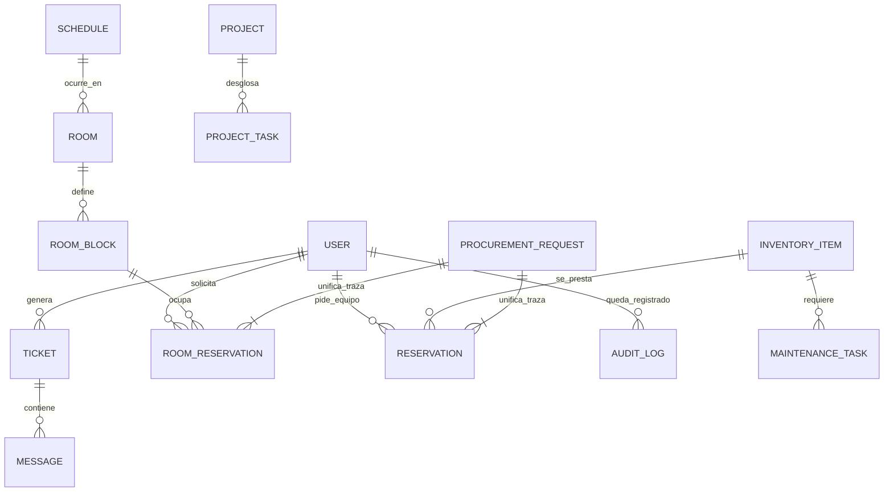

# 🏗️ Manifiesto de Arquitectura de Datos: SGA Pro UAH

Este documento detalla la infraestructura tecnológica que sustenta la gestión institucional de la Facultad de Ingeniería, diseñada para garantizar la transparencia y eficiencia en el acceso a recursos académicos.

## 1. Engine de Base de Datos
El proyecto utiliza una **Arquitectura de Base de Datos Única** para garantizar la integridad referencial y la velocidad de acceso:

- **Motor**: PostgreSQL (Producción) / SQLite (Entorno de Desarrollo).
- **ORM**: TypeORM (Object-Relational Mapping) para una gestión de datos tipada y segura.
- **Paradigma**: Relacional con soporte para tipos enumerados (Roles) y trazabilidad de transacciones.

## 2. Mapa de Entidades Institucionales
El sistema gestiona la información a través de las siguientes 18 tablas interconectadas:

| Categoría | Entidades | Propósito |
| :--- | :--- | :--- |
| **Núcleo** | `User`, `AuditLog` | Gestión de identidades y trazabilidad de acciones (Caja Negra). |
| **Infraestructura** | `Room`, `RoomBlock` | Catálogo de laboratorios, salas y sus bloques horarios. |
| **Operación** | `Schedule`, `RoomReservation` | Control de clases académicas y reservas puntuales de salas. |
| **Recursos** | `InventoryItem`, `Reservation` | Inventario de equipos/materiales y flujo de préstamos. |
| **Logística** | `PurchaseOrder`, `ProcurementRequest` | Gestión de compras y registro unificado de solicitudes. |
| **Mantenimiento** | `MaintenanceTask`, `Bitacora` | Control de fallos, reparaciones y bitácora de incidencias. |
| **Soporte** | `Ticket`, `Message` | Centro de atención institucional vía WebSockets (Tiempo Real). |
| **Conocimiento** | `WikiDoc` | Repositorio documental para guías, protocolos y manuales. |
| **Estrategia** | `Project`, `ProjectTask`, `AdminTask` | Gestión de proyectos de facultad y tareas administrativas. |

## 3. Diagrama de Flujo de Datos (ER)
El siguiente esquema visualiza cómo interactúan los alumnos, docentes y administradores con el núcleo del sistema:

## 4. Flujo Operativo de Solicitudes (Caja Negra)
El sistema implementa un modelo de **Trazabilidad Unificada**:

1. **Solicitud**: Un Alumno o Docente genera una reserva (Sala o Equipo).
2. **Generación de Log**: El Backend crea automáticamente una entrada en `ProcurementRequest` (La Caja Negra).
3. **Estado Pendiente**: La solicitud es visible para los administradores en el Dashboard.
4. **Validación**: El Administrador aprueba o rechaza; la acción queda sellada por siempre en `AuditLog`.
5. **Cierre**: La asignación de recursos se actualiza en tiempo real para todos los usuarios.

---
**SGA Pro UAH | Ingeniería para el Futuro**
