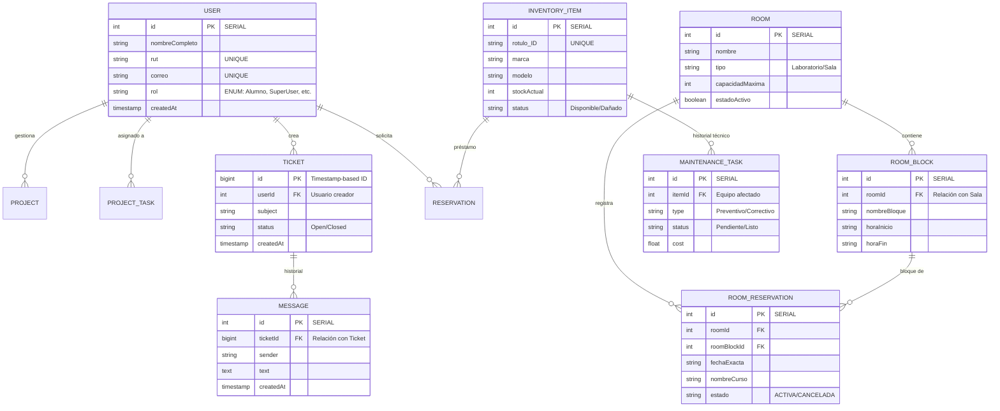

# Documentación de la Base de Datos - SGA Pro

Este documento detalla la estructura completa de la base de datos PostgreSQL, las relaciones entre tablas (PK/FK) y la arquitectura del sistema.

## 1. Diagrama de Entidad-Relación (ERD)
Abajo se muestra la representación gráfica de las tablas ("cuadrados") y sus conexiones.

---

## 2. Detalle de Conectividad (PK/FK)

A continuación se explica cómo están conectadas las tablas principales:

### A. Módulo Académico (Salas y Reservas)
*   **ROOM ↔ ROOM_BLOCK**: Una sala posee múltiples bloques de horario (Mañana, Tarde, Bloque 1, etc.). La conexión se hace mediante `roomId` en la tabla `ROOM_BLOCK`.
*   **ROOM_RESERVATION**: Es la tabla central que une una Sala, un Bloque de horario y una Fecha específica. Utiliza `roomId` y `roomBlockId` como llaves foráneas.

### B. Módulo de Soporte
*   **TICKET ↔ USER**: Cada ticket tiene un `userId` que identifica quién lo abrió.
*   **TICKET ↔ MESSAGE**: Los mensajes de chat están conectados mediante `ticketId` que referencia a la llave primaria `id` de la tabla `TICKET`.

### C. Módulo de Inventario
*   **INVENTORY_ITEM ↔ MAINTENANCE_TASK**: Cualquier tarea de mantenimiento referencia al `itemId` de un equipo específico en el inventario.

---

## 3. Ubicación de los Componentes

*   **Frontend**: Carpeta `/src` (Angular).
*   **Backend**: Carpeta `/backend` (Node.js/Express). Se comunica con la base de datos mediante **TypeORM**.
*   **Base de Datos**: PostgreSQL en contenedor Docker.

---

> [!IMPORTANT]
> Los datos se guardan físicamente en el volumen `./data/db` de la carpeta raíz del proyecto. No borre esta carpeta si desea conservar la información.
