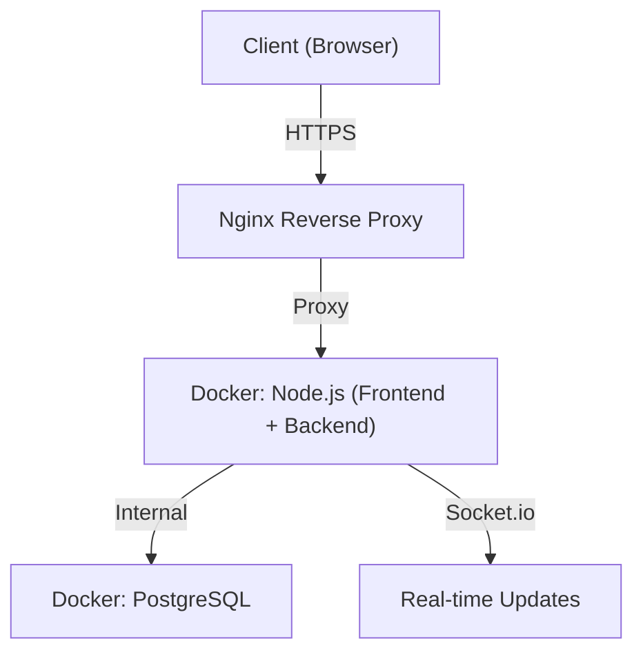
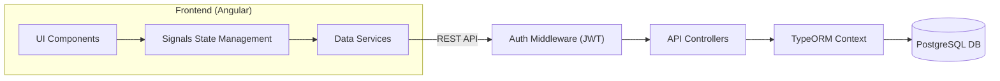

# ANEXO 1 - Recepción de Sistemas Técnicos (SGA Pro UAH)

Este documento detalla el cumplimiento de los lineamientos definidos por la Dirección de Tecnología de la Información y Comunicaciones (DTIC) de la Universidad Alberto Hurtado.

## 1. Plan de Pruebas

### 1.1 Pruebas Funcionales
Las pruebas funcionales se centran en validar que el SGA (Sistema de Gestión de Activos) cumpla con los requisitos operativos de la Facultad de Ingeniería.
- **Módulos Críticos**: Inventario, Reservas, Horarios, Bitácora y Proyectos.
- **Herramientas**: Pruebas manuales documentadas y validación de flujos de usuario (Alumno/Admin).
- **Criterio de Aceptación**: 100% de los flujos críticos (reserva y CRUD) operacionales.

### 1.2 Pruebas de Estrés y Carga
- **Objetivo**: Determinar la concurrencia máxima admitida por el stack Node.js/PostgreSQL.
- **Ambiente**: QA (Test) proporcionado por UAH.
- **Resultados**: [Pendiente de ejecución en servidor UAH].

### 1.3 Pruebas de Seguridad (OWASP/Ethical Hacking)
El sistema ha sido diseñado siguiendo estándares OWASP:
- **XSS (Cross Site Scripting)**: Sanitización de inputs en Angular y Backend.
- **SQL Injection**: Uso exclusivo de TypeORM (ORM) con parámetros tipados para evitar inyecciones.
- **Autenticación**: JWT (JSON Web Tokens) con expiración y almacenamiento seguro.
- **Autorización**: Middleware de roles (Admin/SuperUser/Alumno) en cada endpoint sensitivo.

## 2. Documentación Técnica

### 2.1 Diagrama de Infraestructura TI

- **Servicio Web**: Node.js v20.
- **Base de Datos**: PostgreSQL v15+.
- **Contenedores**: Docker & Docker-Compose.

### 2.2 Diagrama de Arquitectura TI

### 2.3 Documentación de Código Fuente
- **Repositorio**: GitHub (Jesus-Nunez-91/sgaproactualizado).
- **Lenguaje**: TypeScript (Frontend & Backend).
- **Framework**: Angular 17+ (SSR) & Express (Node.js).

### 2.4 Servicios Externos
- **Socket.io**: Para notificaciones en tiempo real (Inscrito en el stack).
- **SweetAlert2**: Para feedback visual y diálogos.
- **XLSX**: Para reportes en Excel.
- **jsPDF/AutoTable**: Para reportes institucionales en PDF.

## 3. Ambientes y Publicación

### 3.1 Desarrollo
- Entorno local Dockerizado.
- Base de datos de desarrollo persistente.

### 3.2 Test (QA)
- Acceso vía SFTP/SSH proporcionado por UAH TICS.
- Sincronización de base de datos vía scripts SQL.

### 3.3 Paso a Producción
- Protocolo: DTIC UAH realiza el despliegue final basándose en el ambiente de Test exitoso.
